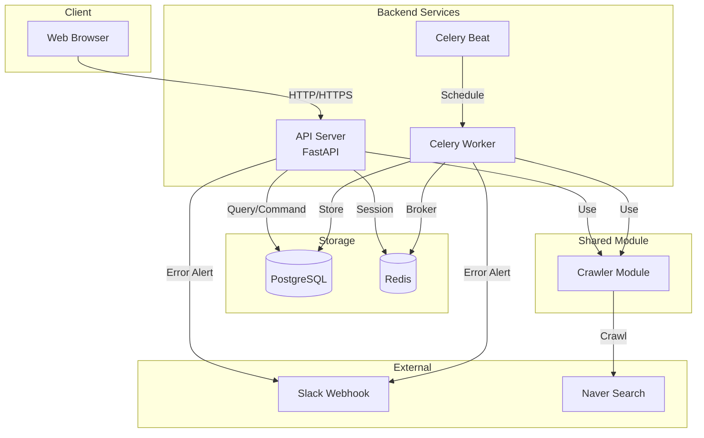
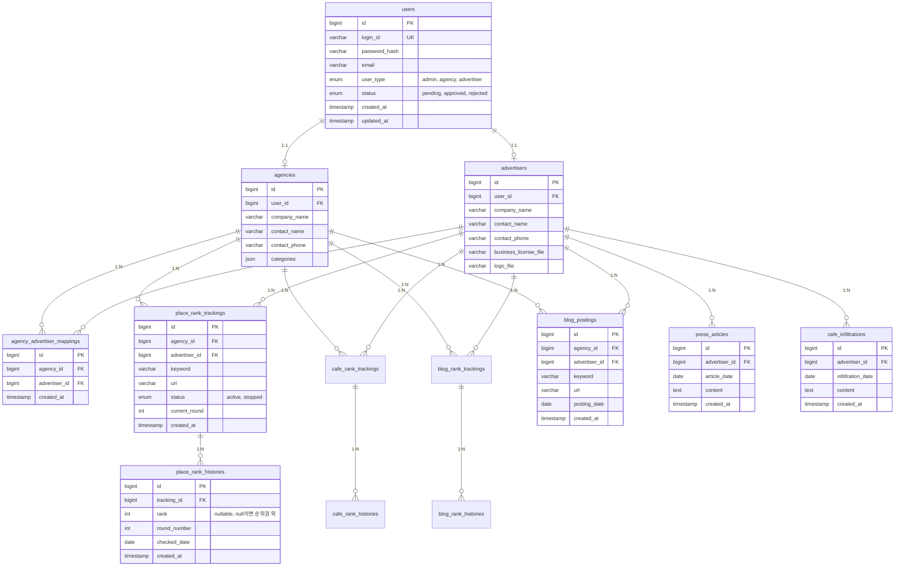
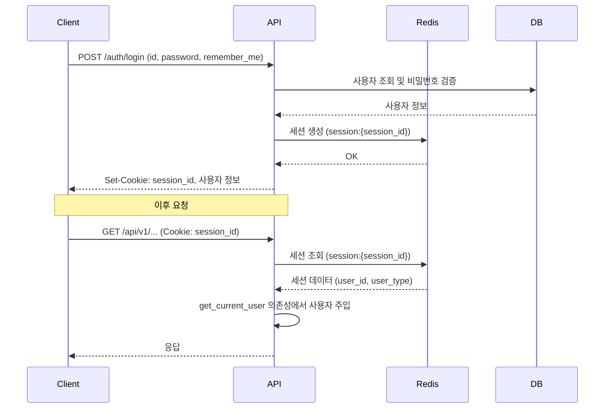
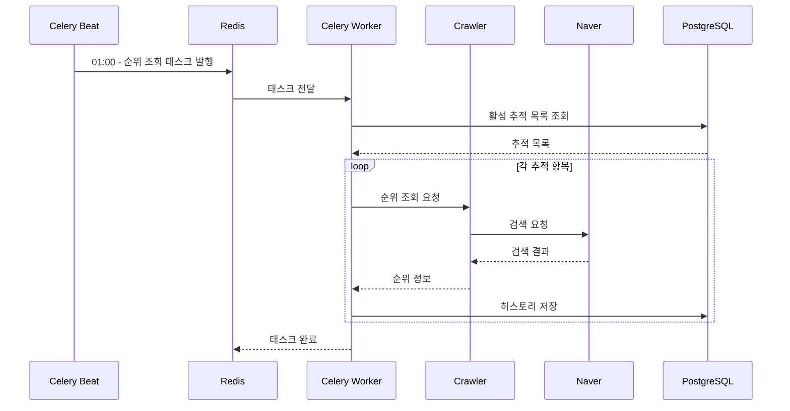

# 시스템 설계서

## 1. 개요

### 1.1 목적

본 문서는 알리다고(Announce-Go) 시스템의 기술 아키텍처를 정의합니다. 광고 업체가 수행한 작업 결과를 기록하고, 광고주에게 성과를 보여주는 서비스를 위한 백엔드 시스템 설계를 다룹니다.

### 1.2 기술 스택

| 구분 | 기술 |
|------|------|
| 언어 | Python 3.11+ |
| 웹 프레임워크 | FastAPI |
| ORM | SQLAlchemy |
| 데이터베이스 | PostgreSQL |
| 캐시/세션/브로커 | Redis |
| 스케줄러 | Celery + Celery Beat |
| 컨테이너 | Docker |

---

## 2. 시스템 아키텍처

### 2.1 전체 구성도



### 2.2 구성 요소

| 구성 요소 | 설명 |
|-----------|------|
| API Server | FastAPI 기반 REST API 서버. 사용자 요청 처리 및 실시간 순위 조회 |
| Celery Beat | 스케줄러. 매일 새벽 1시에 순위 추적 태스크 트리거 |
| Celery Worker | 백그라운드 작업 처리. 등록된 키워드의 순위를 조회하고 DB에 저장 |
| Crawler Module | 네이버 검색 결과 크롤링. API 서버와 Worker에서 공통 사용 |
| PostgreSQL | 메인 데이터베이스. 사용자, 순위 추적, 히스토리 등 저장 |
| Redis | 세션 저장소 및 Celery 메시지 브로커 (DB 0, prefix로 구분) |
| Slack Webhook | 에러 발생 시 알림 전송 |

---

## 3. 프로젝트 구조

```
app/
├── main.py                 # FastAPI 앱 엔트리포인트
├── core/
│   ├── config.py           # 환경 설정
│   ├── security.py         # 인증/보안 관련
│   ├── dependencies.py     # 공통 의존성 (get_current_user 등)
│   └── exceptions.py       # 커스텀 예외 정의
├── models/                 # SQLAlchemy 모델
│   ├── user.py
│   ├── agency.py
│   ├── advertiser.py
│   ├── tracking.py
│   └── ...
├── schemas/                # Pydantic 스키마 (Request/Response)
│   ├── auth.py
│   ├── user.py
│   └── ...
├── routers/
│   ├── common/             # 공통 API (인증, 회원가입, 파일)
│   │   ├── auth.py
│   │   ├── signup.py
│   │   └── files.py
│   ├── admin/              # 관리자 전용 API
│   │   ├── dashboard.py
│   │   ├── members.py
│   │   ├── place_rank.py
│   │   ├── cafe_rank.py
│   │   ├── blog_rank.py
│   │   ├── blog_posting.py
│   │   ├── press.py
│   │   └── cafe_infiltration.py
│   ├── agency/             # 업체 전용 API
│   │   ├── dashboard.py
│   │   ├── place_rank.py
│   │   ├── cafe_rank.py
│   │   ├── blog_rank.py
│   │   ├── blog_posting.py
│   │   ├── press.py
│   │   └── cafe_infiltration.py
│   └── advertiser/         # 광고주 전용 API
│       ├── dashboard.py
│       ├── place_rank.py
│       ├── cafe_rank.py
│       ├── blog_rank.py
│       ├── blog_posting.py
│       ├── press.py
│       └── cafe_infiltration.py
├── services/               # 비즈니스 로직
│   ├── auth_service.py
│   ├── tracking_service.py
│   └── ...
├── repositories/           # DB 접근 계층
│   ├── user_repository.py
│   ├── tracking_repository.py
│   └── ...
├── crawler/                # 크롤링 모듈 (공용)
│   ├── base.py
│   ├── place_crawler.py
│   ├── cafe_crawler.py
│   └── blog_crawler.py
├── tasks/                  # Celery 태스크
│   ├── celery_app.py
│   └── rank_tasks.py
└── utils/
    ├── slack.py            # Slack 알림 유틸
    └── ...
```

---

## 4. 데이터베이스 설계

### 4.1 ERD



### 4.2 테이블 설명

| 테이블 | 설명 |
|--------|------|
| users | 모든 사용자 공통 정보. user_type으로 역할 구분 |
| agencies | 업체 상세 정보 |
| advertisers | 광고주 상세 정보 |
| agency_advertiser_mappings | 업체-광고주 N:N 매핑 |
| place_rank_trackings | 플레이스 순위 추적 마스터 |
| place_rank_histories | 플레이스 일별 순위 기록 |
| cafe_rank_trackings | 카페 순위 추적 마스터 |
| cafe_rank_histories | 카페 일별 순위 기록 |
| blog_rank_trackings | 블로그 순위 추적 마스터 |
| blog_rank_histories | 블로그 일별 순위 기록 |
| blog_postings | 브랜드 블로그 포스팅 기록 |
| press_articles | 언론 기사 |
| cafe_infiltrations | 카페 침투 |

---

## 5. 인증 및 세션 관리

### 5.1 세션 기반 인증

- **방식**: 세션 쿠키 기반 인증 (Stateful)
- **저장소**: Redis (DB 0, prefix: `session:`)
- **세션 ID**: 쿠키를 통해 클라이언트에 전달

### 5.2 Remember Me

| 옵션 | 세션 만료 시간 |
|------|---------------|
| 체크 안 함 | 브라우저 종료 시 만료 |
| 체크 함 | 30일 (설정 가능) |

### 5.3 사용자 인증 흐름



### 5.4 API 요청 시 사용자 식별

- 사용자는 API 요청 시 본인 정보(회원 ID 등)를 포함할 필요 없음
- 세션에서 자동으로 사용자 정보 추출
- FastAPI Dependency Injection 활용

```
# 의존성 주입 예시 (개념)
def get_current_user(session_id: str) -> User:
    # Redis에서 세션 조회
    # 사용자 정보 반환

@router.post("/place-rank/tracking")
def create_tracking(current_user: User = Depends(get_current_user)):
    # current_user.id를 사용하여 추적 등록
```

---

## 6. API 라우터 구조

### 6.1 URL 구조

| Prefix | 대상 | 설명 |
|--------|------|------|
| `/api/v1` | 공통 | 인증, 회원가입, 파일 |
| `/api/v1/admin` | 관리자 | 회원 관리, 전체 데이터 조회/수정 |
| `/api/v1/agency` | 업체 | 순위 추적 등록, 포스팅 기록 관리 |
| `/api/v1/advertiser` | 광고주 | 매핑된 데이터 조회 (읽기 전용) |

### 6.2 라우터 파일 구성

각 사용자 유형별로 도메인 단위로 라우터 파일을 분리합니다.

```
routers/
├── common/
│   ├── auth.py              # /auth/login, /auth/logout, /auth/session
│   ├── signup.py            # /signup/advertiser, /signup/agency
│   └── files.py             # /files/upload, /files/{id}
├── admin/
│   ├── dashboard.py         # /admin/dashboard/*
│   ├── members.py           # /admin/signup-requests/*, /admin/advertisers/*, /admin/agencies/*
│   ├── place_rank.py        # /admin/place-rank/*
│   ├── cafe_rank.py         # /admin/cafe-rank/*
│   ├── blog_rank.py         # /admin/blog-rank/*
│   ├── blog_posting.py      # /admin/blog-posting/*
│   ├── press.py             # /admin/press/*
│   └── cafe_infiltration.py # /admin/cafe-infiltration/*
├── agency/
│   └── ... (동일 패턴)
└── advertiser/
    └── ... (동일 패턴)
```

---

## 7. 스케줄러 (Celery)

### 7.1 구성

| 구성 요소 | 역할 |
|-----------|------|
| Celery Beat | 스케줄 관리. 정해진 시간에 태스크 트리거 |
| Celery Worker | 태스크 실행. 크롤링 및 DB 저장 수행 |
| Redis | 메시지 브로커 (DB 0, prefix: `celery:`) |

### 7.2 스케줄 설정

| 태스크 | 실행 시간 | 설명 |
|--------|----------|------|
| 순위 조회 | 매일 01:00 (KST) | 활성 상태의 모든 추적 키워드 순위 조회 |

### 7.3 태스크 흐름



---

## 8. 크롤러 모듈

### 8.1 개요

크롤러 모듈은 네이버 검색 결과에서 특정 콘텐츠의 순위를 조회합니다. API 서버(실시간 조회)와 Celery Worker(배치 조회)에서 공통으로 사용됩니다.

### 8.2 지원 기능

| 크롤러 | 대상 | 입력 | 출력 |
|--------|------|------|------|
| PlaceCrawler | 네이버 플레이스 | 키워드, URL | 순위 (없으면 null) |
| CafeCrawler | 네이버 카페 글 | 키워드, URL | 순위 (없으면 null) |
| BlogCrawler | 네이버 블로그 글 | 키워드, URL | 순위 (없으면 null) |

### 8.3 사용 위치

| 사용처 | 용도 |
|--------|------|
| API Server | 실시간 순위 조회 (건바이건, DB 저장 안 함) |
| Celery Worker | 배치 순위 조회 (스케줄, DB 저장) |

---

## 9. 에러 처리 및 Slack 알림

### 9.1 에러 처리 전략

- FastAPI 전역 예외 핸들러로 API 에러 처리
- Celery 태스크 에러 핸들링 (on_failure)
- 모든 에러는 로그 기록 및 Slack 알림 전송

### 9.2 Slack 알림

| 발생 위치 | 알림 내용 |
|-----------|-----------|
| API Server | 500 에러, 예외 발생 시 |
| Celery Worker | 태스크 실패, 크롤링 오류 |

### 9.3 알림 형식

```
[API Error] 에러 타입
- Endpoint: /api/v1/...
- User: user_id
- Message: 에러 메시지
- Time: 2024-01-01 12:00:00

[Celery Error] 태스크 이름
- Task ID: task_id
- Args: (...)
- Message: 에러 메시지
- Time: 2024-01-01 12:00:00
```

---

## 10. 외부 연동

### 10.1 Redis

- **용도**: 세션 저장소, Celery 메시지 브로커
- **DB**: 0
- **Prefix 구분**:
  - `session:` - 세션 데이터
  - `celery:` - Celery 브로커 데이터

### 10.2 PostgreSQL

- **용도**: 메인 데이터베이스
- **연결**: SQLAlchemy 비동기 (asyncpg)

### 10.3 Slack Webhook

- **용도**: 에러 알림 전송
- **방식**: Webhook URL로 POST 요청

### 10.4 추후 연동 예정

- 카카오톡 알림톡 (광고주 알림 발송)
